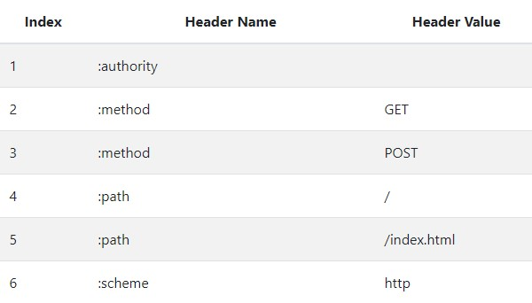

# Http2

### 多路复用

* 复用TCP连接：同个域名只建立1个TCP连接，并将多个请求通过1个TCP连接传输
* 帧数据：由原先的文本数据变成帧数据进行传输，同一个连接传输不同的帧数据，而不同的帧数据来源于不同的请求

### HPack头部压缩

**为什么要压缩：Header是通过字符进行传输的，当请求量越来越多，明显浪费资源，需要进行压缩**

#### 压缩原理

* 静态字典表：客户端和服务端同时维护一个常用的静态键值表，每一个键值对对应一个id，传输这个id就表示

* 状态码等内容也都放入header中进行传输
* 动态字典表：客户端和服务端为每个连接维护一个当台的键值表，可以为这个表动态增加键值对对应的id
* 哈夫曼编码：对传递的值可以选择进行哈夫曼编码来压缩传递的值大小，因为header的值通常是使用ascii字符传递，不会有中文之类的复杂内容，用这种方式进行压缩切实可行

### Server Push

* 服务端可主动推送数据帧给客户端
* 客户端在接收主动推送的数据后可拒绝
* 优化客户端主动连接的资源浪费，主动推送预加载资源
* 可以实现用户活跃的时候进行主动推送数据

### 缺点

* 复用TCP连接，导致一旦网络不好，其中一个数据帧丢包，所有请求都没法正常进行，在网络比较差的情况下，网络表现可能不如Http1.1