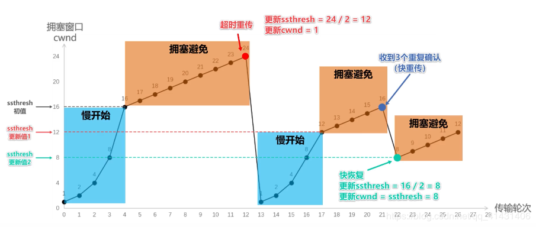
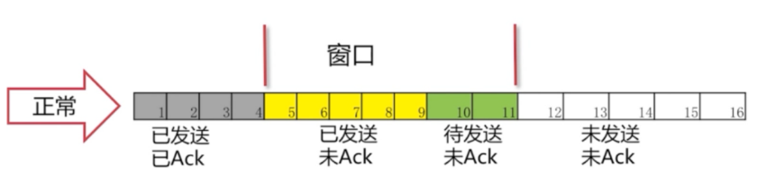

# TCP/IP

## 基本内容

* **TCP是传输层协议，IP协议是网络层协议**
* 每次数据发送都需要Sequence Number且ACK返回SN+1区分非同一流程的请求

## 流量控制

* 慢启动：从1开始*2增加
* 拥塞避免：到达上限后+1增加
* 快重传：接收方出现未按顺序的包，马上连发三哥重传要求
* 快恢复：接收方收到重传要求，窗口上限减半，+1增加

## 滑动窗口协议

